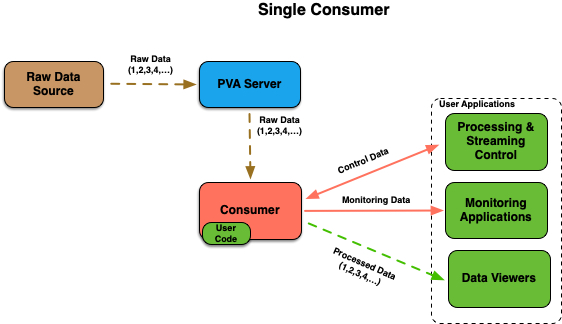
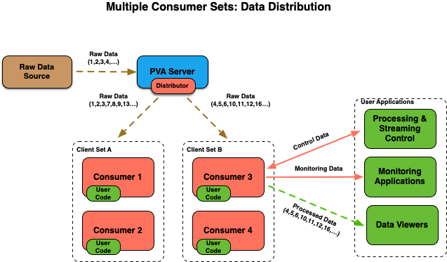
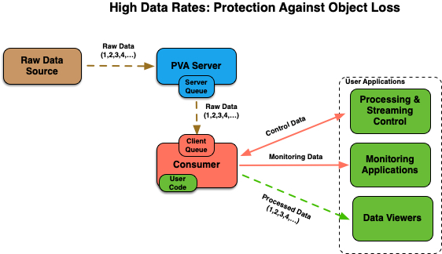

# Streaming Framework

Processing data generated at high rates in real time typically faces many
challenges, from computing and networking infrastructure, to availability of
fast storage, and to user applications themselves. Streaming data directly
form the source into processing applications does not solve all issues,
but it does eliminate potential delays related to file input and output.

PvaPy Streaming Framework allows users to setup distributed streaming 
workflows with a very little effort. This documents describes various
framework components, user interfaces and available command line utilities.

## User Interfaces

Users interact with the framework by implementing the data processor
interface class located in the [pvapy.hpc.userDataProcessor](../pvapy/hpc/userDataProcessor.py) module:

```python
class UserDataProcessor:

    def __init__(self, configDict={}):
        ...

    # Method called at start
    def start(self):
        pass

    # Configure user processor
    def configure(self, configDict):
        pass

    # Process monitor update
    def process(self, pvObject):
        ...
        self.updateOutputChannel(pvObject)
        return pvObject

    # Method called at shutdown
    def stop(self):
        pass
    
    # Reset statistics for user processor
    def resetStats(self):
        pass

    # Retrieve statistics for user processor
    def getStats(self):
        return {}

    # Define PVA types for different stats variables
    def getStatsPvaTypes(self):
        return {}

    # Define output PvObject
    # This method does not need to be implemented if output
    # object has the same structure as the input object
    def getOutputPvObjectType(self):
        return None
```

A python class that derives from UserDataProcessor class and implements 
the above interface is passed into one of the two main command line utilities:
- pvapy-hpc-consumer: used for splitting streams and processing stream objects
- pvapy-hpc-collector: used for gathering streams, sorting and processing
stream objects

A working example of a simple processor that rotates Area Detector images
can be found [here](../examples/hpcAdImageProcessorExample.py). There are
also several processor classes for Area Detector images that can be used 
out of the box:
- [AD Image Data Encryptor](../pvapy/hpc/adImageDataEncryptor.py): encrypts
images
- [AD Image Data Decryptor](../pvapy/hpc/adImageDataDecryptor.py): decrypts
images
- [AD Output File Processor](../pvapy/hpc/adOutputFileProcessor.py): saves output files

In addition to the above consumer and collector commands, the streaming 
framework also relies on the following:
- pvapy-mirror-server: can be used for data distribution in those cases
when the original data source does not have distributor plugin, for stream 
isolation and IOC protection from high client loads, as bridge between 
network interfaces, etc.
- pvapy-ad-sim-server: testing utility that can generate and serve 
NtNdArray objects (Area Detector images) at frame rates exceeding 10k fps

## Examples

All of the examples described below should work out of the box, assuming
that the EPICS libraries have built in [distributor plugin](dataDistributorPlugin.md),
which is the case for the recent PvaPy pip and conda packages. However,
depending on the machine used for running them, some of the command
line arguments (e.g., frame rates, server and client queue sizes, etc.)
might have to be tweaked in order for examples to run without lost frames.
A medium range workstation (e.g. dual Intel Xeon E5-2620 2.40GHz CPU, 24
logical cores, 64GB RAM, local SSD drives) should be able to run all
examples shown here without any issues. Note that some commands use
[sample AD image processor](../examples/hpcAdImageProcessorExample.py) as
external (user) code.

### Single Consumer

The first example illustrates a basic use case with a single data consumer 
processing data. Although this can be easily achived with basic 
EPICS APIs/CLIs, this demonstrates application monitoring and control features
built into the framework.

<p align="center">
  
</p>

On terminal 1, run the consumer command: 

```sh
$ pvapy-hpc-consumer --input-channel pvapy:image --control-channel consumer:*:control --status-channel consumer:*:status --output-channel consumer:*:output --processor-file /path/to/hpcAdImageProcessorExample.py --processor-class HpcAdImageProcessor --report-period 10 --log-level debug
```

The above command will establish monitor on the 'pvapy:image' channel, and will create
channels for output, application status and control using default consumer id '1' that
replaces the '*' character. Application status will be generated every 10 seconds, and
log level of 'debug' ensures that processing log will be displayed on the screen.

On terminal 2, generate small (128x128, uint8) test images at 1Hz for 60 seconds:

```sh
$ pvapy-ad-sim-server -cn pvapy:image -nx 128 -ny 128 -dt uint8 -rt 60 -fps 1
```

After server starts publishing images, the consumer terminal should display processing output.

On terminal 3, you can interact with application's output, status and control channels:

```sh
$ pvget -r uniqueId consumer:1:output # processed image
$ pvget consumer:1:status # application status
$ pvput consumer:1:control '{"command" : "configure", "args" : "{\"x\":100}"}' # configure application
$ pvget consumer:1:control # get last command status
$ pvput consumer:1:control '{"command" : "stop"}' # shutdown consumer process

```

After the shutdown command, the consumer process should exit.

### Multiple Consumers

This example illustrates how to spawn multiple consumers which all receive and
process the same set of images. 

<p align="center">
  
</p>

On terminal 1, run the consumer command:

```sh
$ pvapy-hpc-consumer --input-channel pvapy:image --control-channel consumer:*:control --status-channel consumer:*:status --output-channel consumer:*:output --processor-file /local/sveseli/BDP/DEMO/hpcAdImageProcessorExample.py --processor-class HpcAdImageProcessor --report-period 10 --log-level debug --n-consumers 2
```

This command is the same as before, with additional option that requests 2 consumers
spawned, with IDs of 1 and 2. Each consumer will run as a separate process.

On terminal 2, generate images as before:

```sh
$ pvapy-ad-sim-server -cn pvapy:image -nx 128 -ny 128 -dt uint8 -rt 60 -fps 1
```

After server starts publishing images, the consumer terminal should display processing output, with both consumers receiving and processing all images (1,2,3,4,...). Images
processed by consumer 1 should be accessible on the 'consumer:1:output' channel, and
images processed by consumer 2 should be accessible on the 'consumer:2:output' channel.

### Multiple Consumers with Data Distribution

This example illustrates how to spawn multiple consumers that receive images in
alternate order.

<p align="center">
  
</p>

On terminal 1, run the consumer command:

```sh
$ pvapy-hpc-consumer --input-channel pvapy:image --control-channel consumer:*:control --status-channel consumer:*:status --output-channel consumer:*:output --processor-file /local/sveseli/BDP/DEMO/hpcAdImageProcessorExample.py --processor-class HpcAdImageProcessor --report-period 10 --log-level debug --n-consumers 2 --distributor-updates 1
```

This command will direct the distributor plugin to give one sequential update to each
of its clients.

On terminal 2, generate images:

```sh
$ pvapy-ad-sim-server -cn pvapy:image -nx 128 -ny 128 -dt uint8 -rt 60 -fps 1
```

After server starts publishing images, the consumer terminal should display processing
output, with one consumers receiving images (1,3,5,...) and the other one receiving images
(2,4,6,...).

### Multiple Consumer Sets with Data Distribution

This example illustrates how to distribute the same set of images between 
multiple sets of consumers.

<p align="center">
  
</p>

On terminal 1, run the consumer command that starts 2 consumers with IDs 1 and 2 in the 
set 'A', and directs distributor plugin to give every consumer in the set 3 
sequential updates:


```sh
$ pvapy-hpc-consumer --input-channel pvapy:image --control-channel consumer:*:control --status-channel consumer:*:status --output-channel consumer:*:output --processor-file /local/sveseli/BDP/DEMO/hpcAdImageProcessorExample.py --processor-class HpcAdImageProcessor --report-period 10 --log-level debug --n-consumers 2 --distributor-updates 3 --consumer-id 1 --n-distributor-sets 2 --distributor-set A
```

The option '--n-distributor-sets 2' allows the framework to correctly calculate
number of images that all consumers should receive so that application status
can display accurate statistics with respect to number of missed frames.

On terminal 2, run the consumer command that starts 2 consumers with IDs 3 and 4 in the
set 'B', and directs distributor plugin to give every consumer in the set 3 
sequential updates:

```sh
$ pvapy-hpc-consumer --input-channel pvapy:image --control-channel consumer:*:control --status-channel consumer:*:status --output-channel consumer:*:output --processor-file /local/sveseli/BDP/DEMO/hpcAdImageProcessorExample.py --processor-class HpcAdImageProcessor --report-period 10 --log-level debug --n-consumers 2 --distributor-updates 3 --consumer-id 3 --n-distributor-sets 2 --distributor-set B
```

On terminal 3, generate images:

```sh
$ pvapy-ad-sim-server -cn pvapy:image -nx 128 -ny 128 -dt uint8 -rt 60 -fps 1
```

After server starts publishing images, both consumers in th first set will be receiving
and processing images (1,2,3,7,8,9,13,...), and both consumers in the second set
will be receiving and processing images (4,5,6,10,11,12,16,...).


### Protection Against Lost Data

In those cases when data source streams objects at high rates and/or user application
processing times are not predictable (e.g., when processing incoming objects in batches),
there are two options that can be used for protecting application against lost frames:

- Server queue: EPICS libraries allow each client to request its own queue, which
provides protection against the "overrun" problem, where the server replaces channel
reecord before the client has a chance to retrieve it. Note that server queue sizes
are configurable, and that they increase the server (IOC) memory footprint.
- Client (monitor) queue: PvaPy channel monitor can copy incoming objects into a
'PvObjectQueue' rather than process them immediately on monitor updates. This
provides protection against unpredictable processing times, but it will also increase 
consumer process memory footprint. 

The purpose of examples in this section is to illustrate the two options above.
As noted before, the frame rates shown here might have to be adjusted depending on the
machine used.

<p align="center">
  
</p>

On terminal 1, start single consumer process without any protection against frame loss:

```sh
$ pvapy-hpc-consumer --input-channel pvapy:image --control-channel consumer:*:control --status-channel consumer:*:status --output-channel consumer:*:output --processor-class pvapy.hpc.userDataProcessor.UserDataProcessor --report-period 10
```

On terminal 2 generate frames at high rate (10kHz) and adjust the reporting period
('-rp' option, given in number of frames) accordingly:

```sh
$ pvapy-ad-sim-server -cn pvapy:image -nx 128 -ny 128 -dt uint8 -rt 60 -fps 10000 -rp 10000
```

After 60 seconds consumer application should report number of overruns and missed
frames greater than zero.

