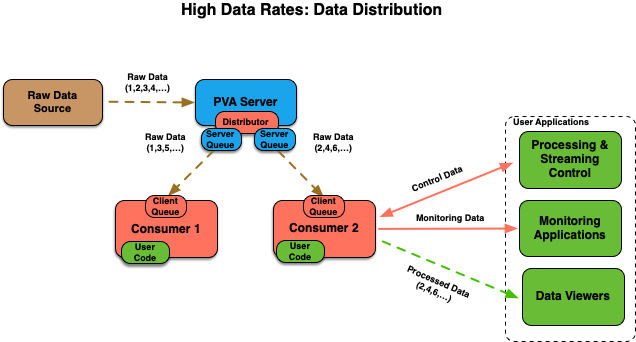
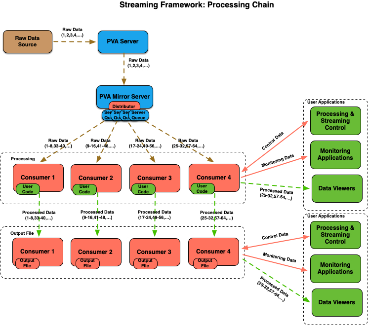
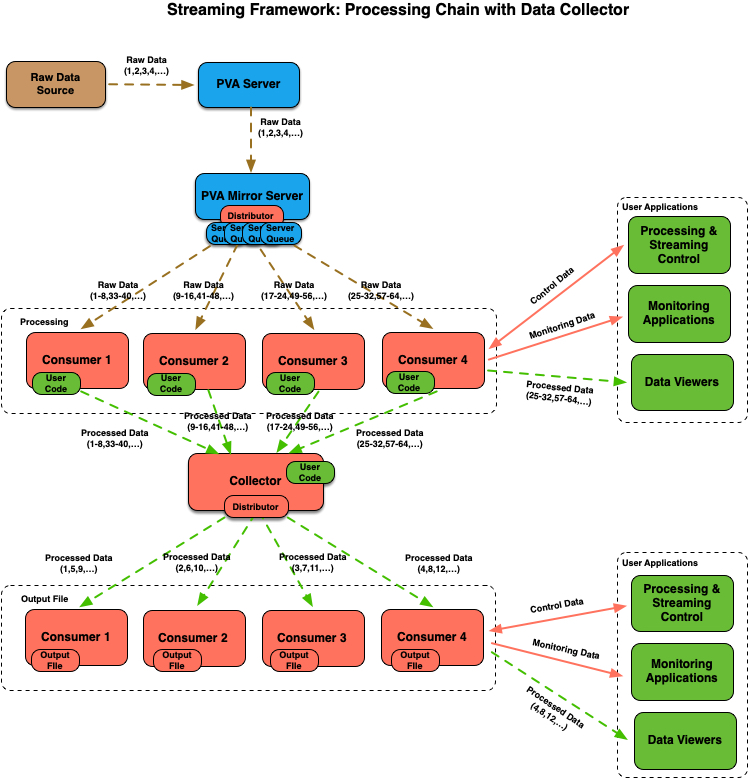
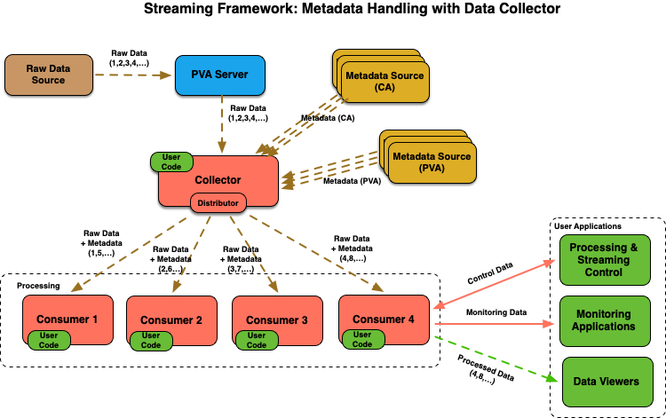
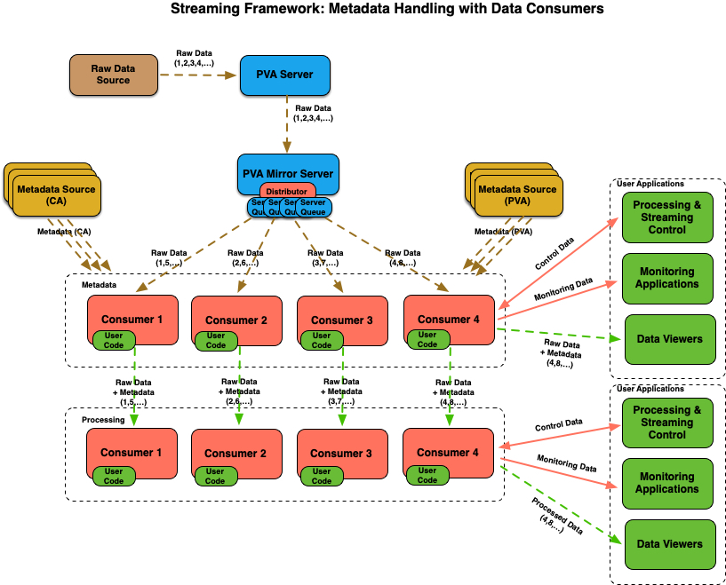
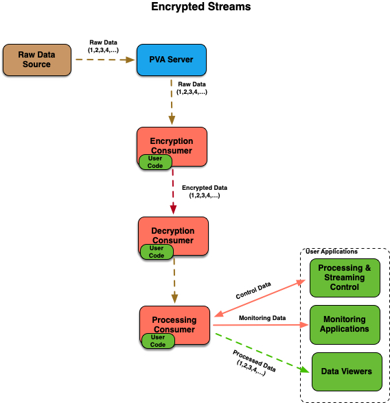

# Streaming Framework

Processing data generated at high rates in real time typically faces many
challenges, from computing and networking infrastructure, to availability of
fast storage, and to user applications themselves. Streaming data directly
form the source into processing applications does not solve all issues,
but it does eliminate potential delays related to file input and output.

PvaPy Streaming Framework allows users to setup distributed streaming 
workflows with a very little effort. This documents describes various
framework components, user interfaces and available command line utilities.

## User Interfaces

Users interact with the framework by implementing the data processor
interface class located in the [pvapy.hpc.userDataProcessor](../pvapy/hpc/userDataProcessor.py) module:

```python
class UserDataProcessor:

    def __init__(self, configDict={}):
        ...
        # The following will be set after processor gets instantiated.
        self.processorId = None
        self.pvaServer = None
        self.outputChannel = None
        self.objectIdField = None
        self.metadataQueueMap = {}

    # Method called at start
    def start(self):
        pass

    # Configure user processor
    def configure(self, configDict):
        pass

    # Process monitor update
    def process(self, pvObject):
        ...
        self.updateOutputChannel(pvObject)
        return pvObject

    # Method called at shutdown
    def stop(self):
        pass
    
    # Reset statistics for user processor
    def resetStats(self):
        pass

    # Retrieve statistics for user processor
    def getStats(self):
        return {}

    # Define PVA types for different stats variables
    def getStatsPvaTypes(self):
        return {}

    # Define output PvObject
    # This method does not need to be implemented if output
    # object has the same structure as the input object
    def getOutputPvObjectType(self):
        return None
```

A python class that derives from UserDataProcessor class and implements 
the above interface is passed into one of the two main command line utilities:
- pvapy-hpc-consumer: used for splitting streams and processing stream objects
- pvapy-hpc-collector: used for gathering streams, sorting and processing
stream objects

A working example of a simple processor that rotates Area Detector images
can be found [here](../examples/hpcAdImageProcessorExample.py). There are
also several processor classes for Area Detector images that can be used 
out of the box:
- [AD Image Data Encryptor](../pvapy/hpc/adImageDataEncryptor.py): encrypts
images
- [AD Image Data Decryptor](../pvapy/hpc/adImageDataDecryptor.py): decrypts
images
- [AD Output File Processor](../pvapy/hpc/adOutputFileProcessor.py): saves output files

The encryptor and decryptor processors require python 'rsa' and 'pycryptodome'
packages for encryption utilities.

In addition to the above consumer and collector commands, the streaming 
framework also relies on the following:
- pvapy-mirror-server: can be used for data distribution in those cases
when the original data source does not have distributor plugin, for stream 
isolation and IOC protection from high client loads, as bridge between 
network interfaces, etc.
- pvapy-ad-sim-server: testing utility that can generate and serve 
NtNdArray objects (Area Detector images) at frame rates exceeding 10k fps

## Examples

All of the examples described below should work out of the box, assuming
that the EPICS libraries have built in [distributor plugin](dataDistributorPlugin.md),
which is the case for the recent PvaPy pip and conda packages. However,
depending on the machine used for running them, some of the command
line arguments (e.g., frame rates, server and client queue sizes, etc.)
might have to be tweaked in order for examples to run without lost frames.
A medium range workstation (e.g. dual Intel Xeon E5-2620 2.40GHz CPU, 24
logical cores, 64GB RAM, local SSD drives) should be able to run all
examples shown here without any issues. Note that some commands use
[sample AD image processor](../examples/hpcAdImageProcessorExample.py) or
[sample AD metadata processor](../examples/hpcAdMetadataProcessorExample.py) as
external (user) code. Also, instead of generating random image data, one
could, for example, concatenate actual image data into a set of NumPy arrays
and pass that file into the pvapy-ad-sim-server command using the
'-if /path/to/images.npy' option.

### Single Consumer

The first example illustrates a basic use case with a single data consumer 
processing data. Although this can be easily achived with basic 
EPICS APIs/CLIs, this demonstrates application monitoring and control features
built into the framework.

<p align="center">
  
</p>

On terminal 1, run the consumer command (make sure to correct the path to the
downloaded image processor example): 

```sh
$ pvapy-hpc-consumer \
    --input-channel pvapy:image \
    --control-channel consumer:*:control \
    --status-channel consumer:*:status \
    --output-channel consumer:*:output \
    --processor-file /path/to/hpcAdImageProcessorExample.py \
    --processor-class HpcAdImageProcessor \
    --report-period 10 \
    --log-level debug
```

The above command will establish monitor on the 'pvapy:image' channel, and will create
channels for output, application status and control using default consumer id '1' that
replaces the '*' character. Application status will be generated every 10 seconds, and
log level of 'debug' ensures that processing log will be displayed on the screen.

On terminal 2, generate small (128x128, uint8) test images at 1Hz for 60 seconds:

```sh
$ pvapy-ad-sim-server -cn pvapy:image -nx 128 -ny 128 -dt uint8 -rt 60 -fps 1
```

After server starts publishing images, the consumer terminal should display processing output.

On terminal 3, you can interact with application's output, status and control channels:

```sh
$ pvget -r uniqueId consumer:1:output # processed image
$ pvget consumer:1:status # application status
$ pvput consumer:1:control '{"command" : "configure", "args" : "{\"x\":100}"}' # configure application
$ pvget consumer:1:control # get last command status
$ pvput consumer:1:control '{"command" : "stop"}' # shutdown consumer process

```

After the shutdown command, the consumer process should exit.

### Multiple Consumers

This example illustrates how to spawn multiple consumers which all receive and
process the same set of images. 

<p align="center">
  
</p>

On terminal 1, run the consumer command:

```sh
$ pvapy-hpc-consumer \
    --input-channel pvapy:image \
    --control-channel consumer:*:control \
    --status-channel consumer:*:status \
    --output-channel consumer:*:output \
    --processor-file /path/to/hpcAdImageProcessorExample.py \
    --processor-class HpcAdImageProcessor \
    --report-period 10 \
    --log-level debug \
    --n-consumers 2
```

This command is the same as before, with additional option that requests 2 consumers
spawned, with IDs of 1 and 2. Each consumer will run as a separate process.

On terminal 2, generate images as before:

```sh
$ pvapy-ad-sim-server -cn pvapy:image -nx 128 -ny 128 -dt uint8 -rt 60 -fps 1
```

After server starts publishing images, the consumer terminal should display processing output, with both consumers receiving and processing all images (1,2,3,4,...). Images
processed by consumer 1 should be accessible on the 'consumer:1:output' channel, and
images processed by consumer 2 should be accessible on the 'consumer:2:output' channel.

### Multiple Consumers with Data Distribution

This example illustrates how to spawn multiple consumers that receive images in
alternate order.

<p align="center">
  
</p>

On terminal 1, run the consumer command:

```sh
$ pvapy-hpc-consumer \
    --input-channel pvapy:image \
    --control-channel consumer:*:control \
    --status-channel consumer:*:status \
    --output-channel consumer:*:output \
    --processor-file /path/to/hpcAdImageProcessorExample.py \
    --processor-class HpcAdImageProcessor \
    --report-period 10 \
    --log-level debug \
    --n-consumers 2 \
    --distributor-updates 1
```

This command will direct the distributor plugin to give one sequential update to each
of its clients.

On terminal 2, generate images:

```sh
$ pvapy-ad-sim-server -cn pvapy:image -nx 128 -ny 128 -dt uint8 -rt 60 -fps 1
```

After server starts publishing images, the consumer terminal should display processing
output, with one consumers receiving images (1,3,5,...) and the other one receiving images
(2,4,6,...).

### Multiple Consumer Sets with Data Distribution

This example illustrates how to distribute the same set of images between 
multiple sets of consumers.

<p align="center">
  
</p>

On terminal 1, run the consumer command that starts 2 consumers 
with IDs 1 and 2 in the set 'A', and directs distributor plugin to give
every consumer in the set 3 sequential updates:

```sh
$ pvapy-hpc-consumer \
    --input-channel pvapy:image \
    --control-channel consumer:*:control \
    --status-channel consumer:*:status \
    --output-channel consumer:*:output \
    --processor-file /path/to/hpcAdImageProcessorExample.py \
    --processor-class HpcAdImageProcessor \
    --report-period 10 \
    --log-level debug \
    --n-consumers 2 \
    --distributor-updates 3 \
    --consumer-id 1 \
    --n-distributor-sets 2 \
    --distributor-set A
```

The option '--n-distributor-sets 2' allows the framework to correctly calculate
number of images that all consumers should receive so that application status
can display accurate statistics with respect to number of missed frames.

On terminal 2, run the consumer command that starts 2 consumers with IDs 3 and 4 in the
set 'B', and directs distributor plugin to give every consumer in the set 3 
sequential updates:

```sh
$ pvapy-hpc-consumer \
    --input-channel pvapy:image \
    --control-channel consumer:*:control \
    --status-channel consumer:*:status \
    --output-channel consumer:*:output \
    --processor-file /path/to/hpcAdImageProcessorExample.py \
    --processor-class HpcAdImageProcessor \
    --report-period 10 \
    --log-level debug \
    --n-consumers 2 \
    --distributor-updates 3 \
    --consumer-id 3 \
    --n-distributor-sets 2 \
    --distributor-set B
```

On terminal 3, generate images:

```sh
$ pvapy-ad-sim-server -cn pvapy:image -nx 128 -ny 128 -dt uint8 -rt 60 -fps 1
```

After server starts publishing images, both consumers in th first set will be receiving
and processing images (1,2,3,7,8,9,13,...), and both consumers in the second set
will be receiving and processing images (4,5,6,10,11,12,16,...).


### Protection Against Lost Data

In those cases when data source streams objects at high rates and/or user application
processing times are not predictable (e.g., when processing incoming objects in batches),
there are two options that can be used for protecting application against lost frames:

- Server queue: EPICS libraries allow each client to request its own queue, which
provides protection against the "overrun" problem, where the server replaces channel
record before the client has a chance to retrieve it. Note that server queue sizes
are configurable, and that they increase the server (IOC) memory footprint.
- Client (monitor) queue: PvaPy channel monitor can copy incoming objects into a
'PvObjectQueue' rather than process them immediately on monitor updates. This
provides protection against unpredictable processing times, but it will also increase 
consumer process memory footprint. 

<p align="center">
  
</p>

The purpose of examples in this section is to illustrate the two options above.
As noted before, the frame rates shown here might have to be adjusted
depending on the machine used.

#### Single Consumer

On terminal 1, start single consumer process without any protection against frame loss, using basic (pass through) data processor.
:

```sh
$ pvapy-hpc-consumer \
    --input-channel pvapy:image \
    --control-channel consumer:*:control \
    --status-channel consumer:*:status \
    --output-channel consumer:*:output \
    --processor-class pvapy.hpc.userDataProcessor.UserDataProcessor \
    --report-period 10
```

On terminal 2 generate frames at high rate (10kHz) and adjust the reporting period
('-rp' option, given in number of frames) accordingly:

```sh
$ pvapy-ad-sim-server -cn pvapy:image -nx 128 -ny 128 -dt uint8 -rt 60 -fps 10000 -rp 10000
```

After 60 seconds consumer application should report number of overruns and
missed frames greater than zero.

We can now modify the consumer command to include server queue. In terminal 1, run the following command:

```sh
$ pvapy-hpc-consumer \
    --input-channel pvapy:image \
    --control-channel consumer:*:control \
    --status-channel consumer:*:status \
    --output-channel consumer:*:output \
    --processor-class pvapy.hpc.userDataProcessor.UserDataProcessor \
    --report-period 10 \
    --server-queue-size 1000
```

On terminal 2 start generating frames at the same rate as before:

```sh
$ pvapy-ad-sim-server -cn pvapy:image -nx 128 -ny 128 -dt uint8 -rt 60 -fps 10000 -rp 10000
```

After 60 second server runtime, there should be no overruns and missed frames reported by the consumer process.

#### Multiple Consumers with Data Distribution

With data distributor plugin, each consumer gets its own server and/or
client queue.

<p align="center">
  
</p>

We first demonstrate what happens if we use application that cannot keep up
with the data source. For this we agan use the sample AD image processor,
and request both server and client (monitor) queues. On terminal 1 run
the following command:

```sh
pvapy-hpc-consumer \
    --input-channel pvapy:image \
    --control-channel consumer:*:control \
    --status-channel consumer:*:status \
    --output-channel consumer:*:output \
    --processor-file /path/to/hpcAdImageProcessorExample.py \
    --processor-class HpcAdImageProcessor \
    --report-period 10 \
    --server-queue-size 100 \
    --monitor-queue-size 1000
```

On terminal 2, generate images at a frame rate sufficiently high to overwhelm
a single consumer. For example, if the sample processor can handle frames at
about 3kHz, 5kHz is a reasonable choice for the server:

```sh
$ pvapy-ad-sim-server -cn pvapy:image -nx 128 -ny 128 -dt uint8 -rt 60 -fps 5000 -rp 5000
```

Since our consumer application now maintains client queue of size 1000, it
should start reporting rejected frames (i.e., those that were delivered
to the client code, but were not queued for processing because client queue was
full). The application should be also reporting no overrruns or missed frames.

We can now distribute data between two consumers using the following command
on terminal 1:

```sh
pvapy-hpc-consumer \
    --input-channel pvapy:image \
    --control-channel consumer:*:control \
    --status-channel consumer:*:status \
    --output-channel consumer:*:output \
    --processor-file /path/to/hpcAdImageProcessorExample.py \
    --processor-class HpcAdImageProcessor \
    --report-period 10 \
    --server-queue-size 100 \
    --monitor-queue-size 1000 \
    --n-consumers 2 \
    --distributor-updates 1
```

On terminal 2 we run as before:

```sh
$ pvapy-ad-sim-server -cn pvapy:image -nx 128 -ny 128 -dt uint8 -rt 60 -fps 5000 -rp 5000
```

Once server starts updating images, we should observe no frames rejected by
the client queue, no missed frames, and each consumer processing images
at a rate that is about half of the server frame rate. This also
demonstrates that data distribution can be easily combined with 
server-side queues.

We can also scale the previous use case easily by updating the '--n-consumers' 
option. On terminal 1 run the following command:

```sh
pvapy-hpc-consumer \
    --input-channel pvapy:image \
    --control-channel consumer:*:control \
    --status-channel consumer:*:status \
    --output-channel consumer:*:output \
    --processor-file /path/to/hpcAdImageProcessorExample.py \
    --processor-class HpcAdImageProcessor \
    --report-period 10 \
    --server-queue-size 100 \
    --monitor-queue-size 1000 \
    --n-consumers 4 \
    --distributor-updates 1
```

On terminal 2 increase frame rate as well:

```
$ pvapy-ad-sim-server -cn pvapy:image -nx 128 -ny 128 -dt uint8 -rt 60 -fps 8000 -rp 8000
```

All consumers should keep up and none should be reporting frame loss.

### Processing Chains

This example demonstrates how stream processing can be done in multiple stages,
with each stage running on a different machine or a set of machines.
This is accomplished by using the output of the first set of consumers as input
to the second set of consumers. The example also uses Mirror Server, which
forwards streamed objects from the source to the first set of consumers.

<p align="center">
  
</p>

On terminal 1, start four consumers producing output on the 'processor:*:output'
channels:

```sh
$ pvapy-hpc-consumer \
    --input-channel pvapy:image \
    --control-channel processor:*:control \
    --status-channel processor:*:status \
    --output-channel processor:*:output \
    --processor-file /path/to/hpcAdImageProcessorExample.py \
    --processor-class HpcAdImageProcessor \
    --report-period 10 \
    --server-queue-size 100 \
    --monitor-queue-size 1000 \
    --n-consumers 4 \
    --distributor-updates 8
```

Each processing consumer will be getting 8 sequential updates, and will be using
small server and client side queues. 

On terminal 2, create output folder for saving images, and use the built-in
processor for saving output files:

```sh
$ rm -rf /path/to/output/data &&  mkdir -p /path/to/output/data
$ pvapy-hpc-consumer \
    --input-channel processor:*:output \
    --output-channel file:*:output \
    --control-channel file:*:control \
    --status-channel file:*:status \
    --processor-class pvapy.hpc.adOutputFileProcessor.AdOutputFileProcessor \
    --processor-args '{"outputDirectory" : "/path/to/output/data", "outputFileNameFormat" : "bdp_{uniqueId:06d}.{processorId}.tiff", "objectIdOffset" : "25"}' \
    --n-consumers 4 \
    --report-period 10 \
    --server-queue-size 1000 \
    --monitor-queue-size 10000
```

The input for this set of consumers is the output of the previous set. We 
used slightly larger queues than for the processing stage, and passed
processor arguments that configure output directory, file format, and object
ID offset, which ensures that application statistics tracking correctly 
accounts for any missing files.

On terminal 3 run the mirror server, which will serve images from the
'ad:image' channel on the 'pvapy:image' channel that is used
as input to the first set of consumers. In this case, we also use small
server-side queue to make sure mirror server does not lose any frames:

```sh
$ pvapy-mirror-server --channel-map "(pvapy:image,ad:image,pva,1000)"
```

On terminal 4 generate images on the 'ad:image' channel:

```sh
$ pvapy-ad-sim-server -cn ad:image -nx 128 -ny 128 -dt uint8 -fps 2000 -rt 60 -rp 2000
```

Once the data source starts publishing images, they will be streamed through
the workflow and processed by each stage, resulting in files being saved
in the designated output folder.

### Data Collector

In this example we show how to use the 'pvapy-hpc-data-collector' utility
for gathering streams distributed by an earlier processing stage. This utility
establishes channel listeners for a number of 'producer' channels, queues 
incoming objects, sorts them using the provided object id field ('uniqueId' 
by default), processes them using the provided data processor class, and
publishes new objects on its output channel. This channel can again be used
as input into another processing stage.

<p align="center">
  
</p>

To get this running, on terminal 1 start four consumers in the
same way as in the previous example, producing output on the 
'processor:*:output' channels:

```sh
$ pvapy-hpc-consumer \
    --input-channel pvapy:image \
    --control-channel processor:*:control \
    --status-channel processor:*:status \
    --output-channel processor:*:output \
    --processor-file /path/to/hpcAdImageProcessorExample.py \
    --processor-class HpcAdImageProcessor \
    --report-period 10 \
    --server-queue-size 100 \
    --monitor-queue-size 1000 \
    --n-consumers 4 \
    --distributor-updates 8
```

On terminal 2, run the following collector command:

```sh
$ pvapy-hpc-collector \
    --collector-id 1 \
    --producer-id-list 1,2,3,4 \
    --input-channel processor:*:output \
    --control-channel collector:*:control \
    --status-channel collector:*:status \
    --output-channel collector:*:output \
    --processor-class pvapy.hpc.userDataProcessor.UserDataProcessor \
    --report-period 10 \
    --server-queue-size 1000 \
    --collector-cache-size 10000 \
    --monitor-queue-size 2000
```

Here, we specified producer IDs, which will be used to construct input channel
names by replacing the '*' character in the string given in the
'--input-channel' option. In addition to server and client (monitor)
queues, we also specified size for the collector cache used for sorting
incoming objects. The collector will publish images sorted by the 'uniqueId'
on its output channel 'collector:<collector id>:output'.

On terminal 3, create output folder for saving images, and use the built-in
processor for saving output files. The difference from the previous case
is that we are using collector output as input, and we are also directing
collector's PVA server to distribute one file at a time between all four
file processors: 

```sh
$ rm -rf /path/to/output/data &&  mkdir -p /path/to/output/data
$ pvapy-hpc-consumer \
    --input-channel collector:1:output \
    --output-channel file:*:output \
    --control-channel file:*:control \
    --status-channel file:*:status \
    --processor-class pvapy.hpc.adOutputFileProcessor.AdOutputFileProcessor \
    --processor-args '{"outputDirectory" : "/path/to/output/data", "outputFileNameFormat" : "bdp_{uniqueId:06d}.{processorId}.tiff"}' \
    --n-consumers 4 \
    --report-period 10 \
    --server-queue-size 1000 \
    --monitor-queue-size 10000 \
    --distributor-updates 1
```

On terminal 4 run the mirror server as before, mirroring 'ad:image' to 
'pvapy:image' channel:

```sh
$ pvapy-mirror-server --channel-map "(pvapy:image,ad:image,pva,1000)"
```

On terminal 5 generate images on the 'ad:image' channel:

```sh
$ pvapy-ad-sim-server -cn ad:image -nx 128 -ny 128 -dt uint8 -fps 2000 -rt 60 -rp 2000
```

Once the data source starts publishing images, they will be streamed through
all the components of the system, and saved into the designated output folder.

### Metadata Handling with Data Collector

In many cases images need to be associated with with various pieces of metadata (e.g., position information)
before processing. The streaming framework allows one to receive PV updates from any number of metadata channels
(CA or PVA), which are made available to the user processing module as a dictionary of metadata 
channel names/PvObject queues.

<p align="center">
  
</p>

This example uses [sample AD metadata processor](../examples/hpcAdMetadataProcessorExample.py) module which is capable of 
associating images with available metadata based on their timestamp comparison, and producing NtNdArray objects
that contain additional metadata attributes. To see how it works, 
download the sample metadata processor and start data collector on terminal 1 
using the following command:

```sh
$ pvapy-hpc-collector \
    --collector-id 1 \
    --producer-id-list 1 \
    --input-channel pvapy:image \
    --control-channel collector:*:control \
    --status-channel collector:*:status \
    --output-channel collector:*:output \
    --processor-file /path/to/hpcAdMetadataProcessorExample.py \
    --processor-class HpcAdMetadataProcessor \
    --report-period 10 \
    --server-queue-size 100 \
    --collector-cache-size 100 \
    --monitor-queue-size 1000 \
    --metadata-channels pva://x,pva://y,pva://z
```

On terminal 2 generate test images on channel 'pvapy:image' and PVA metadata on channels 'x', 'y', and 'z':

```sh
$ pvapy-ad-sim-server \
    -cn pvapy:image -nx 128 -ny 128 -fps 100 -rp 100 -rt 60 \
    -mpv pva://x,pva://y,pva://z
```

After image generation starts, on terminal 3 inspect both the original and processed images. The output channel 
should contain the original image data plus values for x, y, and z attributes:

```sh
$ pvget pvapy:image # original image, no metadata
$ pvget collector:1:output # should contain x,y,z metadata
```

Note that the generated PVA metadata channels have a structure containing value and timestamp:

```sh
$ pvinfo x
x
Server: ...
Type:
    structure
        double value
        time_t timeStamp
            long secondsPastEpoch
            int nanoseconds
            int userTag
```

Since retrieving PVs from CA IOCs results in the same channel structure as in the above example, 
the sample metadata processor works with either CA or PVA metadata channels. This can be verified
by replacing the AD simulation server command with the following:

```sh
$ EPICS_DB_INCLUDE_PATH=/path/to/epics-base/dbd pvapy-ad-sim-server \
    -cn pvapy:image -nx 128 -ny 128 -fps 1 -rt 60 \
    -mpv x,y,z
```

This command will start CA IOC and generate CA metadata channels 'x', 'y', and 'z'. 
Note that it requires path to the EPICS Base dbd folder. For example, if you are using PvaPy
conda package, this folder would be located at '/path/to/conda/envs/env-name/opt/epics/dbd'.

### Metadata Handling with Data Consumers

Distributing metadata processing should allow one to handle higher frame rates. In this example
we also use mirror server for all image and metadata channels.

<p align="center">
  
</p>

On terminal 1, start 4 metadata processors listening on 'pvapy:image' channel:

```sh
$ pvapy-hpc-consumer \
    --consumer-id 1 \
    --n-consumers 4 \
    --input-channel pvapy:image \
    --control-channel consumer:*:control \
    --status-channel consumer:*:status \
    --output-channel consumer:*:output \
    --processor-file /path/to/hpcAdMetadataProcessorExample.py \
    --processor-class HpcAdMetadataProcessor \
    --processor-args '{"timestampTolerance" : 0.00025}' \
    --report-period 10 \
    --server-queue-size 2000 \
    --accumulate-objects 10 \
    --monitor-queue-size 0 \
    --distributor-updates 1 \
    --metadata-channels pva://pvapy:x,pva://pvapy:y,pva://pvapy:z
```

Each consumer will accumulate 10 images in the queue before processing them, in order to make sure
all metadata arrives before it is needed.

On terminal 2, start mirror server mapping all channels:

```sh
$ pvapy-mirror-server \
    --channel-map "(pvapy:image,ad:image,pva,1000),(pvapy:x,ad:x,pva,1000),(pvapy:y,ad:y,pva,1000),(pvapy:z,ad:z,pva,1000)"
```

On terminal 3 generate images and metadata:

```sh
$ pvapy-ad-sim-server \
    -cn ad:image -nx 128 -ny 128 -fps 2000 -rp 2000 -rt 60 \
    -mpv pva://ad:x,pva://ad:y,pva://ad:z
```

Processing speed gains are not linear when compared to the single consumer case, because
each consumer receives alternate set of images and all metadata values, and hence some
metadata values will have to be discarded. This will be reflected in the metadata
processor statistics.

### Data Encryption

This example illustrates how data can be encrypted in the first processing
stage of the streaming workflow, and decrypted before processing. This 
example does require additional python packages ('rsa' and 'pycryptodome')
that provide encryption utilities.

<p align="center">
  
</p>

On terminal 1 start the encryption consumer, which requires path to your 
private SSH key as input (the key should not require passphrase):

```sh
$ pvapy-hpc-consumer \
    --input-channel pvapy:image \
    --control-channel enc:*:control \
    --status-channel enc:*:status \
    --output-channel enc:*:output \
    --processor-class pvapy.hpc.adImageDataEncryptor.AdImageDataEncryptor \
    --processor-args '{"privateKeyFilePath" : "/path/to/id_rsa", "sign" : 1}' 
    --report-period 10 \
    --log-level debug
```

The encrypted data will be signed, which will increase time needed for
encryption.

On terminal 2 run the decryption consumer, taking input from the encryption
output channel:

```sh
$ pvapy-hpc-consumer \
    --input-channel enc:*:output \
    --control-channel dec:*:control \
    --status-channel dec:*:status \
    --output-channel dec:*:output \
    --processor-class pvapy.hpc.adImageDataDecryptor.AdImageDataDecryptor \
    --oid-field objectId \
    --processor-args '{"privateKeyFilePath" : "/path/to/id_rsa", "verify" : 1}' \
    --report-period 10 \
    --log-level debug
```

Note that the encrypted object ID field is 'objectId', and that data will be 
verified after decryption. The output of the encryption channel will
be a standard AD image (NtNdArray) object.

On terminal 3 run the sample processing consumer, which takes input
from the decryption stage output and rotates images:

```sh
$ pvapy-hpc-consumer \
    --input-channel dec:*:output \
    --control-channel proc:*:control \
    --status-channel proc:*:status \
    --output-channel proc:*:output \
    --processor-file /path/to/hpcAdImageProcessorExample.py \
    --processor-class HpcAdImageProcessor \
    --report-period 10 \
    --log-level debug
```

On terminal 4 generate images:

```sh
$ pvapy-ad-sim-server -cn pvapy:image -nx 128 -ny 128 -dt uint8 -rt 60 -fps 1
```

After raw images start getting published, consumer terminals should start
displaying encryption, decryption and processing outputs.

On terminal 5 we can inspect output from the different processing stages:

```sh
$ pvget enc:1:output # encrypted data
$ pvget dec:1:output # decrypted (raw) data
$ pvget proc:1:output # processed image
```

## Performance Testing

All tests described in this section have been performed with PvaPy version 
5.1.0 (Python 3.9 conda package) on a 64-bit linux machine with 96 logical cores (Intel Xeon 
Gold 6342 CPU with hyperthreading enabled) running at 3.5 GHz, and 
with 2TB of RAM. Image server and all consumers were running on the
same machine. 

### Throughput Tests

In order to asses how much data can be pushed through the framework we
ran a series of tests using the [base system user processor](../pvapy/hpc/userDataProcessor.py)
that does not manipulate image and hence does not generate any additional
load on the test machine. 

On terminal 1, we used the following command to spawn 1 or more
consumer processes:

```sh
$ pvapy-hpc-consumer \
    --input-channel pvapy:image \
    --control-channel consumer:*:control \
    --status-channel consumer:*:status \
    --output-channel consumer:*:output \
    --processor-class pvapy.hpc.userDataProcessor.UserDataProcessor \
    --report-period 10 \
    --server-queue-size SERVER_QUEUE_SIZE \
    --n-consumers N_CONSUMERS \
    [--distributor-updates 1]
```

Server queue size varied according to the test image size.
Whenever we used multiple consumers (N_CONSUMERS > 1) data distributor was
turned on using the '--distributor-updates 1' option. For a single consumer
this option was left out.

On terminal 2 images were generated for 60 seconds using the following command:

```sh
$ pvapy-ad-sim-server \
    -cn pvapy:image -nf 100 -dt uint8 -rt 60 \
    -nx FRAME_SIZE -ny FRAME_SIZE -fps FRAME_RATE -rp FRAME_RATE
```

The above command was able to reliably generate images at stable rates 
of up to 20 KHz. Going beyond that number, the resulting output frame rate varied 
more than 1-2 Hz, and was not deemed to be stable enough for testing.

A given test was deemed successful if no frames were 
missed during the 60 second server runtime. Results for the maximum
simulated detector rate that image consumers were able to sustain 
without missing any frames are shown below:

* Image size: 4096 x 4096 (uint8, 16.78 MB); Server queue size: 100

| Consumers | Frames/<br>second  | Frames/second/<br>consumer | Frames/<br>minute | Data rate/<br>consumer | Total data rate |
| ---:      | ---:           | ---:                       | ---:          | ---:                   | ---:            |
|        1  |      150       |     150                    |     9000      | 2.52 GBps              |    2.52 GBps    |
|        4  |      600       |     150                    |    36000      | 2.52 GBps              |   10.07 GBps    |
|        8  |     1000       |     125                    |    60000      | 2.10 GBps              |   16.78 GBps    |
|       10  |     1200       |     120                    |    72000      | 2.01 GBps              |   20.13 GBps    |

* Image size: 2048 x 2048 (uint8, 4.19 MB); Server queue size: 200

| Consumers | Frames/<br>second  | Frames/second/<br>consumer | Frames/<br>minute | Data rate/<br>consumer | Total data rate |
| ---:      | ---:           | ---:                       | ---:          | ---:                   | ---:            |
|        1  |      700       |     700                    |    42000      | 2.94 GBps              |    2.94 GBps    |
|        4  |     2600       |     650                    |   156000      | 2.73 GBps              |   10.91 GBps    |
|        8  |     4000       |     500                    |   240000      | 2.10 GBps              |   16.78 GBps    |
|       10  |     4500       |     450                    |   270000      | 1.89 GBps              |   18.88 GBps    |

* Image size: 1536 x 1024 (int16, 3.15 MB); Server queue size: 400

| Consumers | Frames/<br>second  | Frames/second/<br>consumer | Frames/<br>minute | Data rate/<br>consumer | Total data rate |
| ---:      | ---:           | ---:                       | ---:          | ---:                   | ---:            |
|        1  |     1200       |    1200                    |    72000      | 3.77 GBps              |    3.77 GBps    |
|        4  |     3600       |     900                    |   216000      | 2.83 GBps              |   11.32 GBps    |
|        8  |     5600       |     700                    |   336000      | 2.20 GBps              |   17.62 GBps    |
|       10  |     6000       |     600                    |   360000      | 1.89 GBps              |   18.87 GBps    |

* Image size: 1024 x 1024 (uint8, 1.05 MB); Server queue size: 500

| Consumers | Frames/<br>second  | Frames/second/<br>consumer | Frames/<br>minute | Data rate/<br>consumer | Total data rate |
| ---:      | ---:           | ---:                       | ---:          | ---:                   | ---:            |
|        1  |     3200       |    3200                    |   192000      |      3.36 GBps         |    3.36 GBps    |
|        4  |     10000      |    2500                    |   600000      |      2.62 GBps         |   10.49 GBps    |
|        8  |     12000      |    1500                    |   720000      |      1.57 GBps         |   12.58 GBps    |
|       10  |     14000      |    1400                    |   840000      |      1.47 GBps         |   14.68 GBps    |

* Image size: 512 x 512 (uint8, 0.26 MB); Server queue size: 1000

| Consumers | Frames/second  | Frames/second/<br>consumer | Frames/minute | Data rate/<br>consumer | Total data rate |
| ---:      | ---:           | ---:                       | ---:          | ---:                   | ---:            |
|        1  |     10000      |    10000                   |   600000      |      2.62 GBps         |    2.62 GBps    |
|        4  |     20000      |     5000                   |  1200000      |      1.31 GBps         |    5.24 GBps    |

### Metadata Handling Tests

In order to asses how much data can be pushed through the system in combination with metadata we
ran a series of tests using the [sample AD metadata processor](../examples/hpcAdMetadataProcessorExample.py) module.
For all tests we used 6 PVA metadata channels.

On terminal 1, we used the following command to spawn 1 or more
consumer processes:

```sh
$ pvapy-hpc-consumer \
    --input-channel pvapy:image \
    --control-channel consumer:*:control \
    --status-channel consumer:*:status \
    --output-channel consumer:*:output \
    --processor-file /path/to/hpcAdMetadataProcessorExample.py \
    --processor-class HpcAdMetadataProcessor \
    --processor-class pvapy.hpc.userDataProcessor.UserDataProcessor \
    --report-period 10 \
    --metadata-channels pva://m1,pva://m2,pva://m3,pva://m4,pva://m5,pva://m6 \
    --accumulate-objects 10 \
    --server-queue-size SERVER_QUEUE_SIZE \
    --n-consumers N_CONSUMERS \
    [--distributor-updates 1]
```

Server queue size varied according to the test image size. Image processing was 
slightly delayed via the '--accumulate-objects 10' option, in order to make sure
all metadata is available when before image is processed.
Whenever we used multiple consumers (N_CONSUMERS > 1) data distributor was
turned on using the '--distributor-updates 1'. For a single consumer
this option was left out. Keep in mind that while image data are distributed between 
consumers, metadata updates are not, and hence each image consumer received
six times more metadata updates than image updates.

On terminal 2 images were generated for 60 seconds using the following command:

```sh
$ pvapy-ad-sim-server \
    -cn pvapy:image -nf 100 -dt uint8 -rt 60 \
    -mpv pva://m1,pva://m2,pva://m3,pva://m4,pva://m5,pva://m6 \
    -nx FRAME_SIZE -ny FRAME_SIZE -fps FRAME_RATE -rp FRAME_RATE
```

The above command was able to reliably generate images at rates required for all tests.

A given test was deemed successful if no frames and metadata updates were 
missed during the 60 second server runtime, and if all images were associated
with metadata without any errors. Results for the maximum
simulated detector rate that image consumers were able to sustain 
and process are shown below:

* Image size: 4096 x 4096 (uint8, 16.78 MB); Server queue size: 400

| Consumers | Frames/<br>second  | Frames/second/<br>consumer | Frames/<br>minute | Metadata/<br>second | Metadata/<br>minute | Data rate/<br>consumer | Total data rate |
| ---:      | ---:           | ---:                       | ---:          | ---:            | ---:            | ---:                   | ---:            |
|        1  |      150       |     150                    |     9000      |       900       |     54000       | 2.52 GBps              |    2.52 GBps    |
|        4  |      400       |     100                    |    24000      |      2400       |    144000       | 1.68 GBps              |    6.71 GBps    |
|        8  |      600       |      75                    |    36000      |      3600       |    216000       | 1.26 GBps              |   10.07 GBps    |
|       10  |      700       |      70                    |    42000      |      4200       |    252000       | 1.17 GBps              |   11.74 GBps    |

* Image size: 2048 x 2048 (uint8, 4.19 MB); Server queue size: 600

| Consumers | Frames/<br>second  | Frames/second/<br>consumer | Frames/<br>minute | Metadata/<br>second | Metadata/<br>minute | Data rate/<br>consumer | Total data rate |
| ---:      | ---:           | ---:                       | ---:          | ---:            | ---:            | ---:                   | ---:            |
|        1  |      500       |     500                    |    30000      |      3000       |    180000       |      2.10 GBps         |    2.10 GBps    |
|        4  |      800       |     200                    |    48000      |      4800       |    288000       |      0.84 GBps         |    3.36 GBps    |
|        8  |     1000       |     125                    |    60000      |      6000       |    360000       |      0.52 GBps         |    4.19 GBps    |
|       10  |     1200       |     120                    |    72000      |      7200       |    432000       |      0.50 GBps         |    5.03 GBps    |

* Image size: 1024 x 1024 (uint8, 1.05 MB); Server queue size: 1000

| Consumers | Frames/<br>second  | Frames/second/<br>consumer | Frames/<br>minute | Metadata/<br>second | Metadata/<br>minute | Data rate/<br>consumer | Total data rate |
| ---:      | ---:           | ---:                       | ---:          | ---:            | ---:            | ---:                   | ---:            |
|        1  |     1200       |    1200                    |    72000      |      7200       |    432000       |      1.26 GBps         |    1.26 GBps    |
|        4  |     1600       |     400                    |    96000      |      9600       |    576000       |      0.42 GBps         |    1.68 GBps    |
|        8  |     1800       |     225                    |   108000      |     10800       |    648000       |      0.24 GBps         |    1.89 GBps    |
|       10  |     2000       |     200                    |   120000      |     12000       |    720000       |      0.21 GBps         |    2.10 GBps    |

* Image size: 512 x 512 (uint8, 0.26 MB); Server queue size: 1500

| Consumers | Frames/<br>second  | Frames/second/<br>consumer | Frames/<br>minute | Metadata/<br>second | Metadata/<br>minute | Data rate/<br>consumer | Total data rate |
| ---:      | ---:           | ---:                       | ---:          | ---:            | ---:            | ---:                   | ---:            |
|        1  |     1500       |    1500                    |    90000      |      9000       |    540000       |      0.39 GBps         |    0.39 GBps    |
|        4  |     2400       |     600                    |   144000      |     14400       |    864000       |      0.16 GBps         |    0.63 GBps    |
|        8  |     2800       |     350                    |   168000      |     16800       |   1008000       |      0.09 GBps         |    0.73 GBps    |
|       10  |     3000       |     300                    |   180000      |     18000       |   1080000       |      0.08 GBps         |    0.78 GBps    |

As the number of data consumers increases, number of metadata updates that each consumer has to 
discard increases as well, and hence gains in processing capabilities and in the corresponding
data throughput are getting smaller. Also, not that some optimization could be achieved by batching 
sequential images received by consumers (e.g., using '--distributor-updates 10' option).

